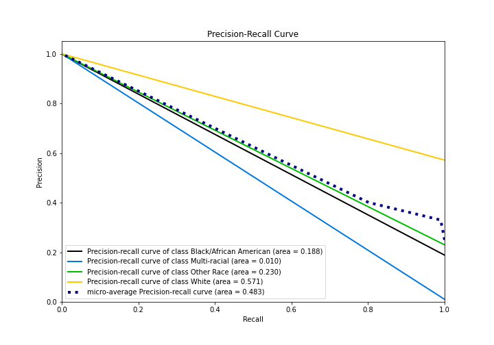

# Summary of 1_Baseline

[<< Go back](../README.md)

## Baseline Classifier (Baseline)
- **n_jobs**: -1
- **num_class**: 4
- **explain_level**: 2

## Validation
 - **validation_type**: split
 - **train_ratio**: 0.75
 - **shuffle**: True
 - **stratify**: True

## Optimized metric
logloss

## Training time

0.7 seconds

### Metric details
|           |   Black/African American |   Multi-racial |   Other Race |       White |   accuracy |   macro avg |   weighted avg |   logloss |
|:----------|-------------------------:|---------------:|-------------:|------------:|-----------:|------------:|---------------:|----------:|
| precision |                        0 |              0 |            0 |    0.571461 |   0.571461 |    0.142865 |       0.326568 |   1.01893 |
| recall    |                        0 |              0 |            0 |    1        |   0.571461 |    0.25     |       0.571461 |   1.01893 |
| f1-score  |                        0 |              0 |            0 |    0.727299 |   0.571461 |    0.181825 |       0.415623 |   1.01893 |
| support   |                      833 |             45 |         1017 | 2527        |   0.571461 | 4422        |    4422        |   1.01893 |

## Confusion matrix
|                                   |   Predicted as Black/African American |   Predicted as Multi-racial |   Predicted as Other Race |   Predicted as White |
|:----------------------------------|--------------------------------------:|----------------------------:|--------------------------:|---------------------:|
| Labeled as Black/African American |                                     0 |                           0 |                         0 |                  833 |
| Labeled as Multi-racial           |                                     0 |                           0 |                         0 |                   45 |
| Labeled as Other Race             |                                     0 |                           0 |                         0 |                 1017 |
| Labeled as White                  |                                     0 |                           0 |                         0 |                 2527 |

## Learning curves

## Confusion Matrix

## Normalized Confusion Matrix

## ROC Curve

## Precision Recall Curve

[<< Go back](../README.md)
