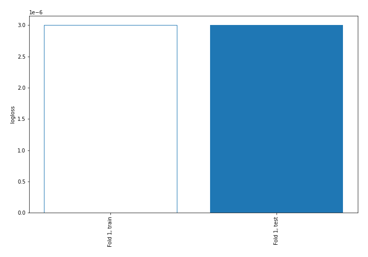
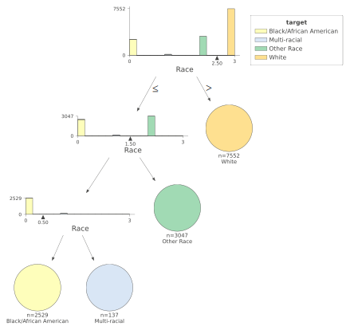
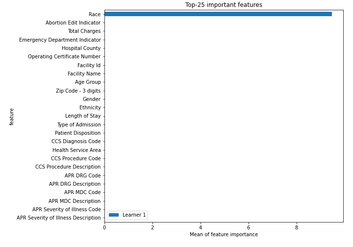
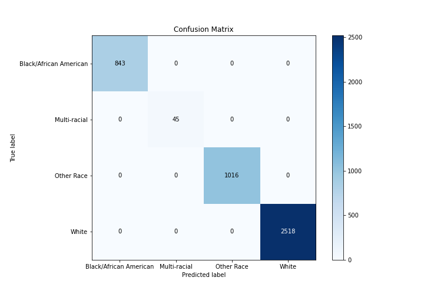
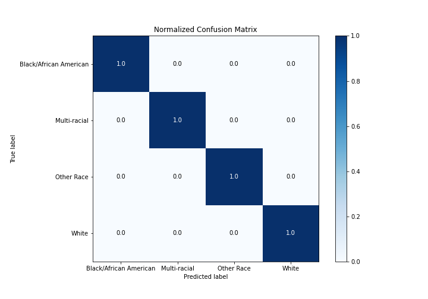
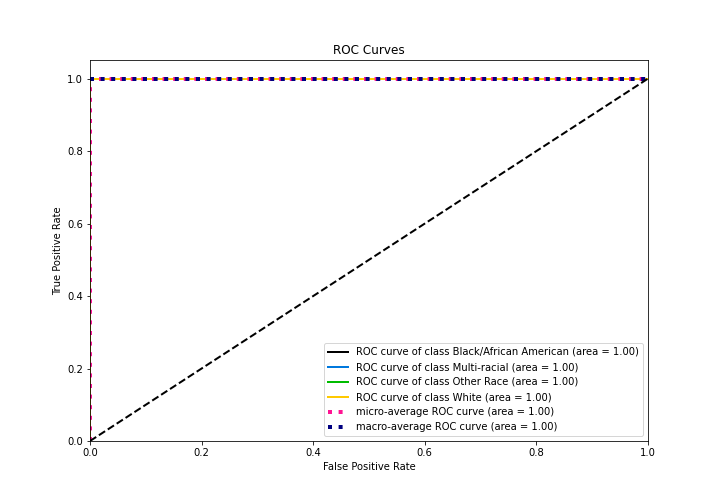
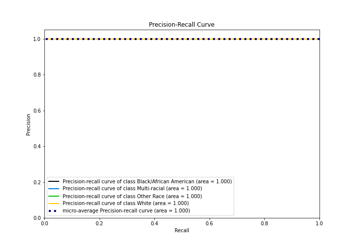
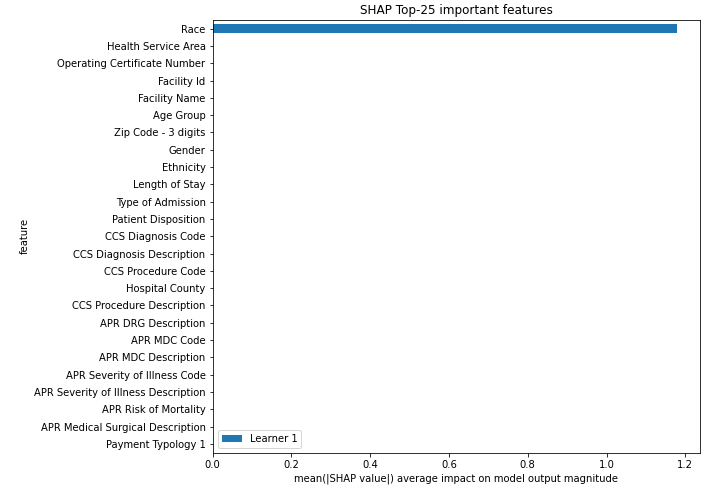

# Summary of 2_DecisionTree

[<< Go back](../README.md)

## Decision Tree
- **n_jobs**: -1
- **criterion**: gini
- **max_depth**: 3
- **num_class**: 4
- **explain_level**: 2

## Validation
 - **validation_type**: split
 - **train_ratio**: 0.75
 - **shuffle**: True
 - **stratify**: True

## Optimized metric
logloss

## Training time

12.6 seconds

### Metric details
|           |   Black/African American |   Multi-racial |   Other Race |   White |   accuracy |   macro avg |   weighted avg |   logloss |
|:----------|-------------------------:|---------------:|-------------:|--------:|-----------:|------------:|---------------:|----------:|
| precision |                        1 |              1 |            1 |       1 |          1 |           1 |              1 |     3e-06 |
| recall    |                        1 |              1 |            1 |       1 |          1 |           1 |              1 |     3e-06 |
| f1-score  |                        1 |              1 |            1 |       1 |          1 |           1 |              1 |     3e-06 |
| support   |                      843 |             45 |         1016 |    2518 |          1 |        4422 |           4422 |     3e-06 |

## Confusion matrix
|                                   |   Predicted as Black/African American |   Predicted as Multi-racial |   Predicted as Other Race |   Predicted as White |
|:----------------------------------|--------------------------------------:|----------------------------:|--------------------------:|---------------------:|
| Labeled as Black/African American |                                   843 |                           0 |                         0 |                    0 |
| Labeled as Multi-racial           |                                     0 |                          45 |                         0 |                    0 |
| Labeled as Other Race             |                                     0 |                           0 |                      1016 |                    0 |
| Labeled as White                  |                                     0 |                           0 |                         0 |                 2518 |

## Learning curves

## Decision Tree 

### Tree #1

### Rules

if (Race > 2.5) then class: White (proba: 100.0%) | based on 7,552 samples

if (Race <= 2.5) and (Race > 1.5) then class: Other Race (proba: 100.0%) | based on 3,047 samples

if (Race <= 2.5) and (Race <= 1.5) and (Race <= 0.5) then class: Black/African American (proba: 100.0%) | based on 2,529 samples

if (Race <= 2.5) and (Race <= 1.5) and (Race > 0.5) then class: Multi-racial (proba: 100.0%) | based on 137 samples

## Permutation-based Importance

## Confusion Matrix

## Normalized Confusion Matrix

## ROC Curve

## Precision Recall Curve

## SHAP Importance

[<< Go back](../README.md)
